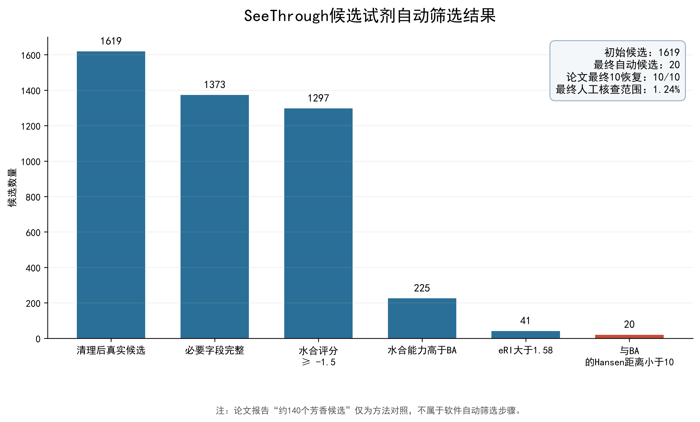

# Amadeus: Automated Screening Framework

**Demo 2.0**｜颅骨透明化试剂候选筛选研究原型

Amadeus 将 SeeThrough 论文补充数据中的候选物，经可配置数值规则、RDKit 结构处理和 Hansen 溶解度参数距离计算，形成可追溯的候选筛选结果、交互式结果视图和可下载报告。

> 研究原型，不用于直接证明安全性、透明化效果或临床适用性。

## 现在能做什么

- **论文复现筛选**：读取 SeeThrough 补充数据 2，按必要字段、水合评分、水合能力、eRI 和与 BA 的 Hansen 距离逐步筛选；每一步均保留候选数量和逐候选审计记录。
- **用户候选筛选**：导入 CSV/XLSX，映射字段，选择水相、有机相、通用或自定义应用配置，并按本轮 `run_id` 隔离输入、结果与报告。
- **化学信息处理**：执行身份映射与冲突记录、RDKit 结构/描述符计算，以及与 BA/VA 的 Hansen 距离计算；身份冲突可在独立页面审核。
- **结果与报告**：查看 20 个自动候选及其筛选过程，下载 Excel 报告、300 DPI PNG 和 SVG；规则筛选页还提供可悬停、缩放的流程与候选散点图。
- **证据与实验工作流**：查看毒性/GHS 证据与数据缺口，基于已确认批次进行配方构建和实验记录；这些页面不生成安全性或透明化效果结论。

当前 SeeThrough 水相候选演示计算链为 **1619 → 1373 → 1297 → 225 → 41 → 20**；自动规则获得 20 个候选，论文最终 10 个候选在自动候选中恢复 **10/10**。

## 公开演示结果

以下两张图由仓库内的 SeeThrough 补充数据运行 Demo 2.0 生成。它们是可复现的演示输出，不构成安全性、透明化效果或临床结论。




相同图表也提供为 SVG 文件，便于在报告或幻灯片中无损使用。

## 与 Demo 1.0 的对比

Demo 2.0 延续 [SeeThrough 参考演示 1.0](https://github.com/sakana-enthusiasts/automatic-screening-framework_SeeThrough_demo_1.0) 的论文数据、筛选阈值、自动计算链、10/10 对照结果和研究边界；它不是新数据集，也不是经过新实验校准的预测模型。变化集中在把已存在的筛选能力整理为可审计的多流程工作台，并补足结果展示。

| 范围 | Demo 1.0 | Demo 2.0 | 对使用者的实际影响 |
| --- | --- | --- | --- |
| 论文复现基线 | SeeThrough 补充数据导入、RDKit/Hansen 处理、规则筛选和 Excel/PNG 导出 | 保持同一输入与 **1619 → 1373 → 1297 → 225 → 41 → 20** 结果链 | 两个版本的论文复现基线可直接对照；2.0 不把“约 140 个芳香候选”误写为软件自动筛选步骤。 |
| 用户候选流程 | README 中提供候选导入和字段映射入口 | 新增按 `run_id` 隔离的一轮用户导入、字段映射、身份/结构/HSP 初筛、配置化规则和运行报告流程 | 多次导入不会与论文复现或其他用户批次混写；可追溯每次输入和规则配置。 |
| 规则配置 | 可配置数值规则 | 提供 SeeThrough 水相、有机相、通用化合物和用户自定义配置；可逐条覆盖规则启用状态 | 同一程序可在不改代码的前提下切换公开参照规则或用户自定义规则。 |
| 身份与冲突处理 | 输出身份映射/冲突记录 | 保留映射与冲突记录，并提供独立的“身份冲突审核”页面和人工确认入口 | 身份不确定项不会被静默当作已确认化合物。 |
| 可视化与公开展示 | Excel/PNG 导出；仓库首页展示两张静态图 | 保留静态 PNG，并新增 SVG、交互式流程柱状图和候选散点图；本 README 再次展示公开结果图 | 网页可直接查看结果；本地可悬停、缩放并下载高分辨率图，而核心筛选不依赖展示层。 |
| 毒性证据 | 部分实现：本地/可选在线证据与 GHS 提示 | 仍为部分实现：展示 PubChem/GHS、人工/本地证据和数据缺口，不作为自动淘汰或安全性判定 | 功能边界保持保守：缺少同条件证据时，系统明确报告“数据不足”，不会虚构结论。 |
| 配方、实验记录 | 作为 Streamlit 工作流入口 | 已确认批次可进入配方构建与实验记录；结果仍以用户提供的可追溯记录为基础 | 可组织后续实验资料，但不等同于实验优化已验证。 |
| 透明化预测与实验优化 | 接口预留，未启用 | 仍是接口预留；无校准训练数据或实验历史时不输出预测/下一轮建议 | 2.0 不把页面或接口包装成已验证模型。 |

## 安装与启动

建议使用 Python 3.11 或与 RDKit 兼容的 Python 环境。

```powershell
python -m venv .venv
.\.venv\Scripts\Activate.ps1
pip install -r requirements.txt
streamlit run 启动程序.py
```

浏览器打开的本地页面中，选择“规则筛选”并点击“重新运行完整筛选”，即可生成当前数据的报告和图表。

公开 Demo 不包含测试与本地审计代码。安装后可先进行基础语法检查：

```powershell
python -m compileall 核心系统 插件 软件界面 设置
```

本地演示不需要 API 密钥。可选在线毒性查询如需密钥，只能置于本机环境变量；不要提交 `.env`、令牌或私人导入表格。

## 本地交互式结果可视化

Demo 默认启用结果可视化。核心计算与展示层相互独立：关闭图表不会影响筛选、报告导出或结果保存。

开发新规则或调整输出字段时，可以临时关闭：

```powershell
$env:AMADEUS_ENABLE_RESULT_VISUALIZATION = "0"
streamlit run 启动程序.py
```

重新打开 PowerShell 或设置为 `1` 后，图表会恢复。该开关适合在核心逻辑尚未稳定时避免界面兼容性干扰开发。

## 模块状态与验证范围

| 模块 | Demo 2.0 当前状态 | 可验证的输入与输出 | 与 1.0 相比 / 不能声称什么 |
| --- | --- | --- | --- |
| 论文复现导入与规则筛选 | 已实现并以公开补充数据验证 | 输入：SeeThrough 补充数据 2；输出：5 步统计、1619 条逐候选记录、20 个自动候选、10/10 论文最终候选对照 | 保持 1.0 的验证目标和结果，不新增论文之外的真实性结论。 |
| 用户候选导入与配置化筛选 | 已实现 | 输入：CSV/XLSX 与字段映射；输出：按 `run_id` 隔离的标准化记录、身份/结构/HSP 初筛、规则结果和报告 | 2.0 的主要工作流扩展；用户数据只保存在本地，公开仓库不含任何用户输入。 |
| RDKit 与 Hansen 距离 | 已实现 | 输入：候选名称/结构及论文物化字段；输出：结构状态、分子描述符、与 BA/VA 的距离 | 保持 1.0 的化学处理基线；映射失败会显示状态，不以猜测结构替代。 |
| 身份冲突审核 | 已实现 | 输入：自动身份映射产生的冲突；输出：冲突表与人工确认后的状态 | 相比 1.0 将“冲突记录”做成可审阅的独立界面；人工确认仍由研究者负责。 |
| 图表、Excel 与可视化 | 已实现 | 输出：Excel、PNG、SVG、交互式流程图与候选散点图 | 在 1.0 静态 Excel/PNG 的基础上增强展示；关闭可视化不改变筛选、报告或保存结果。 |
| 毒性证据视图 | 部分实现 | 输出：GHS/公开来源状态、本地或人工证据、证据缺口与警示 | 与 1.0 一样不自动给出安全性结论，也不把不完整证据转成淘汰规则。 |
| 配方构建与实验记录 | 已实现为研究数据管理工作流 | 输入：已确认批次、配方设置和实验记录；输出：批次化配方/记录视图 | 用于组织可追溯实验资料，不代表透明化效果已经验证。 |
| 透明化预测 | 接口预留 | 仅显示输入就绪状态与接口契约 | 仍无校准模型或训练数据，不输出虚构预测。 |
| 实验优化 | 接口预留 | 仅显示实验历史/优化接口状态 | 仍无明确优化目标和实验历史时的自动下一轮建议。 |

## 已知边界

- 本项目不是经过前瞻性实验验证的透明化效果预测系统；
- 毒性信息目前作为可追溯证据与警示，不会自动转化为安全性结论或候选淘汰结论；
- 实验优化与预测页面不构成实验设计、医疗或临床决策工具；
- 论文最终 10 个候选只用于筛选完成后的对照，不参与自动筛选。

## 数据来源、引用与许可

本仓库没有重新发布论文 PDF，也没有复制论文中可能含第三方权利的插图。筛选规则和演示数据参考：

> Liu, Xinyi; Uchigashima, Motokazu; Oomoto, Ikumi; Saito, Yoshihito; Uchida, Hitoshi; Oginezawa, Shinya; Masuda, Keiko; Satoh, Daisuke; Abe, Manabu; Sakimura, Kenji; Shimizu, Yoshihiro; Murayama, Masanori; Tainaka, Kazuki; and Mikuni, Takayasu. *SeeThrough: a rationally designed skull clearing technique for in vivo brain imaging*. Nature Communications 16, 7584 (2025). DOI: [10.1038/s41467-025-62836-1](https://doi.org/10.1038/s41467-025-62836-1).

Nature 将文章主体标为 CC BY 4.0；个别单独注明来源的第三方素材不在该许可范围内。`数据/论文原始数据/` 中的表格仅用于此研究演示，程序运行时会进行字段/类型清理、数值规则计算和结构映射等处理。完整的署名、许可与修改说明见 [THIRD_PARTY_NOTICES.md](THIRD_PARTY_NOTICES.md)。

项目代码未授予开源许可证；复用、修改或再分发不获授权。详见 [版权声明.md](版权声明.md)。
